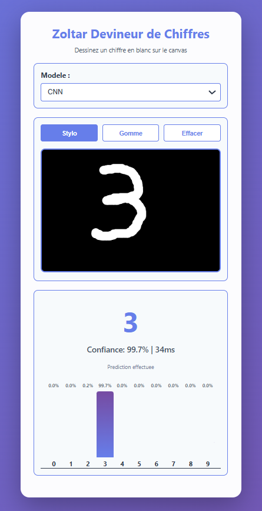

# Zolar - Mnist Digit Classifier with TinyGrad and WebGPU

## Description 

This project implements a system of handwritting recognition numbers (0-9) trained on the *Mnist data* with *TinyGrad*.
It is then exported to *WebGpu* to perform directly in the browser.
The model is trained on python with two differents architectures : *MLP (Multi-Layer Perceptron)* and *CNN (Convolutionnal Neural Network)*.
The user has to draw on a canva and will get predictions of the numbers with a certain probability.

## Features

**Interactive Drawing**
**Two Architectures**
**Prediction with percentage**
**Directly in browser**

## Model Summary

| Model | Architecture | Accuracy | Parameters | Inference Time |
|-------|--------------|----------|------------|----------------|
| **MLP** | 784 → 512 → 512 → 10 | XX.XX% | ~660,000 | ~XXms |
| **CNN** | 2xConv32 → Pool → 2xConv64 → Pool → Dense | XX.XX% | ~140,000 | ~XXms |

## How it works

1. **Training**: Models are trained with TinyGrad on Python with differents configuration for CNN and MLP.
2. **Export**: They are then compiled in WebGPU and weights saved on SafeTensor.
3. **Deployment**: The web application loads the data and then treat it directly on the browser's GPU.
4. **Convert**: It converts the image to the 28*28 standart Mnist, converted to grayscale, normalized to [-1,1].
5. **Predict** It finally predicts the number you drew.

## Technologies Used

- **Python**: Training language
- **tinygrad**: Minimalist and performant deep learning framework
- **WebGPU**: Modern GPU computing API for the web
- **HTML/CSS/JavaScript**: User interface
- **SafeTensors**: Model weight serialization format

## Results

### Project Objectives

- **MLP**: Accuracy ≥ 95% → **Achieved 96.84%**
- **CNN**: Accuracy ≥ 98% → **Achieved 99.00%**

### Best Configurations

**MLP (Config 7 - Optimized):**
- STEPS: 200
- BATCH: 512
- LR: 0.03
- Accuracy: **96.84%**
- Training time: 50.8 second

**CNN (Config 7 - Optimized):**
- STEPS: 200
- BATCH: 512
- LR: 0.03
- Accuracy: **99.00%**
- Training time: 603.5 seconds

## Conclusion

CNN is the superior architecture for image classification due to its 2.16% higher accuracy despite longer training time.
The convolutional layers effectively capture spatial patterns in handwritten digits.

